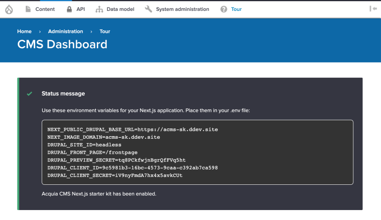
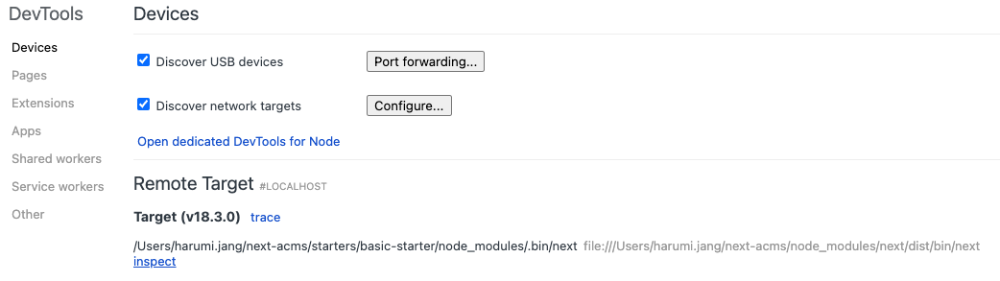

## How to contribute to Next.js for Acquia CMS

1. Have Acquia CMS installed from https://github.com/acquia/next-acms/blob/main/README.md#installation-acquia-cms with your Node environment variables copied to your clipboard.
   > **_NOTE:_** You can use any web server of your choice **_except_** for the built-in PHP server which won't work.



2. Fork the `acquia/next-acms` project repo and pull it down to your local machine (outside of the ACMS directory is recommended) and add the original repo as the upstream.

```
$ cd next-acms
$ git remote add upstream https://github.com/acquia/next-acms
```

3. Create an `.env.local` file in the `/starters` directory in your forked repo and paste in your environment variables from step 1.
4. From the root directory, run `yarn install` then `yarn dev` to start the development server on `http://localhost:3000`.

   > **_NOTE:_** Next.js preview mode only works in production mode. To run in production mode, run `yarn build` then `yarn start` inside the `starters/basic-starter` directory.

5. Now you can make changes to your repo, commit them, push them up to your remote, then create a pull request for `acquia/next-acms` to contribute.

## How to debug with Chrome DevTools

The following approach is with Chrome. For debugging using the VS Code debugger please see: https://nextjs.org/docs/advanced-features/debugging

Running `yarn dev` will also run `NODE_OPTIONS='--inspect'` which will allow you to debug server-side Next.js, and it can be accessed by visiting [chrome://inspect/#devices](url) in your browser.



Click the inspect link at the end of file path at the end of the page, and it will open up a DevTools window. From there, you can click the Sources tab, hit Ctrl+P on Windows/Linux or ⌘+P on macOS to navigate to the file you want to debug.
